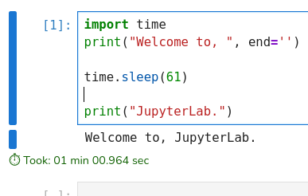
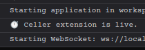

# Celler

#### A JupyterLab extension which shows execution time of a cell



### Requirements

- JupyterLab >= 4.0.0

### Install

Note: You will need NodeJS to build the extension package.

The `jlpm` command is JupyterLab's pinned version of
[yarn](https://yarnpkg.com/) that is installed with JupyterLab. You may use
`yarn` or `npm` in lieu of `jlpm` below.

```bash
# Clone the repo to your local environment
# Change directory to the 'celler' directory
# Install package in development mode
pip install -e "."
# Link your development version of the extension with JupyterLab
jupyter labextension develop . --overwrite
# Rebuild extension Typescript source after making changes
jlpm build
```

After a successful build and installation you should see a message from celler in browser's consol after starting jupyterlab.



### Uninstall

To remove the extension, execute:

```bash
pip uninstall -y celler
```

Or,

```bash
conda remove celler
```
if installed with conda.

Then, check the extension list with:

```bash
jupyter labextension list
```
and remove the extension:
```bash
jupyter labextension uninstall celler
```

#### Packaging the extension

See [RELEASE](RELEASE.md)

*Source code of this extension was provided by ChatGpt*
